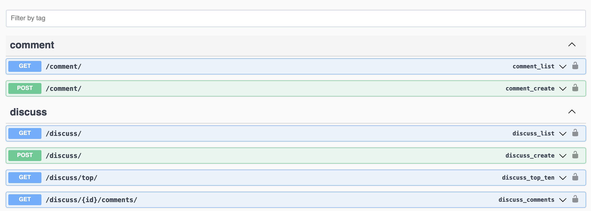

# Reddit style discussion API

### Install library

```
pip install -r requirements.txt
```

### Run server

```
python manage.py runserver
```

### API Document

- Run server first
- Access `/swagger` for documents



`GET` `/discuss`: Get list discussion

`POST` `/discuss`: Create a discussion

`GET` `/discuss/top`: Get top 10 discussion

`POST` `/discuss/{id}/comments`: Get all comments for a given discussion

`GET` `/comments`: Get comments

`POST` `/comments`: Create a comment in discuss or another ones.


